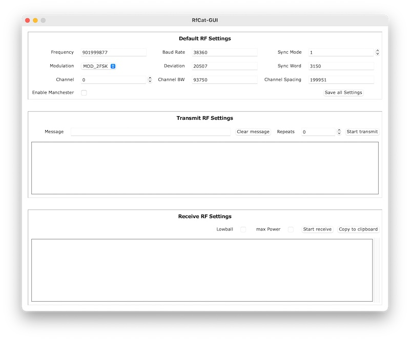

# RfCat-GUI

Feel free to use this software as is for personal use only. Do not use this code in other projects or in commercial products. I am not responsible for issues, mistakes or illegal activities. 

**Again:** I hold no liability for your actions with this code.

**Also important:**

This project is just started ... what does it mean?

- only Python 3.x support (_Python 2.x missing_)
- available is just a simple mockup
- just few parts are working now (_but not tested_)
- missing feature: detailed validations for values (_just high level implementation_)
- missing feature: receive into text area
- missing feature: many rfcat options are not visible or deactivated yet
- missing feature: UX (_not sure if needed but could imagen_)
- etc.

## Build

```shell
# clone repository
$ git clone https://github.com/Lupin3000/rfcat-gui.git

# change into cloned directory
$ cd rfcat-gui

# create virtualenv
$ virtualenv -p python3 .env

# install requirements
$ pip install -r requirements.txt

# create macOS application
$ python setup.py py2app -A
```

## Usage

Note: PlugIn your Dongle before start application!

```shell
# change directory
$ cd rfcat-gui/dist/

# run application
$ open -a RfCat-GUI.app 
```

You should see following now:


